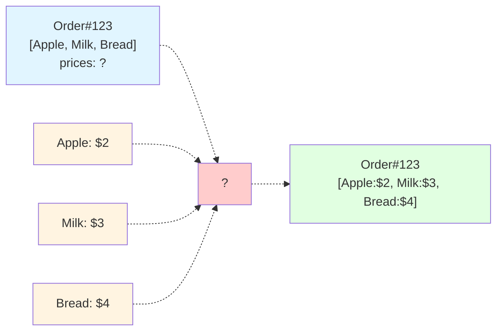
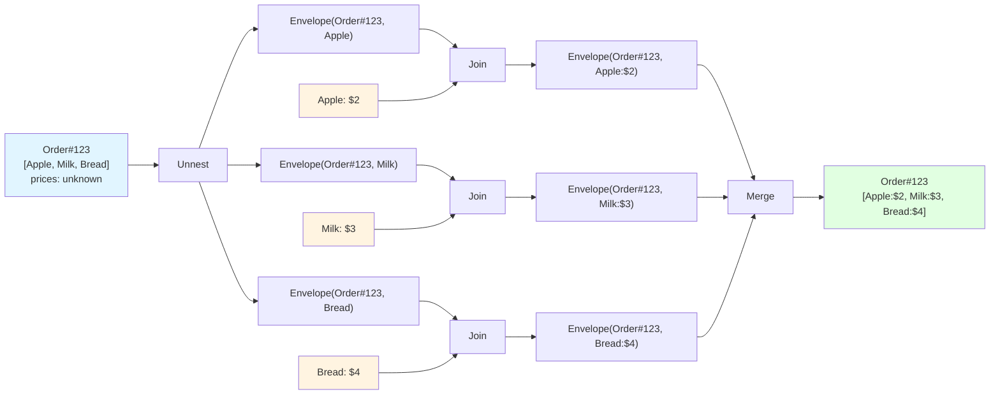

# Flink One-to-Many and Many-to-One Pattern

Enriching a stream of events with a secondary stream of events is a common use case for Apache Flink.

However, when objects in the main stream are of one-to-many character, we face a challenge in Apache Flink as the join is no longer 1:1 and we cannot use join operators directly.

In a SQL world, one would use the `UNNEST` or `CROSS JOIN` operator and this article goes through the same pattern with Apache Flink DataStream API.

We take an example of orders as main stream events, each order has a list of product ids to be linked with real products from secondary stream.

The pattern itself is reusable and open-sourced, available for download at [michalklempa/flink-tools](https://github.com/michalklempa/flink-tools)

## Problem

We will work with an example of orders, which is the one-to-many object, holding an order id and list of product ids. 

```java
class Order:
  String id
  Long ingestTime
  List<Product> productList
```

Product would have a simple id and price:

```java
class Product:
  String id
  Long ingestTime
  Integer price
```

Notice how both events have the `ingestTime`,  for the purpose of this example, that will be our event time and watermark assignment field. It is the timestamp when the event was ingested into our systems - therefore the name `ingestTime`.

In the incoming stream of Orders:

```java
DataStream<Order> orderDataStream = env.fromCollection(...)
```

list of Products in the Order would hold products with their respective `id`s, but missing price.

We would like to join (enrich) the order data stream, with another secondary stream of Products:

```java
DataStream<Product> productDataStream = nev.fromCollection(...)
```

where respective product is linked into order product list by its id.

Our goal depicted as simple `?` in the diagram:




## Flink Join

Lets first explore the basic join solution with Apache Flink. For the purpose of the example, the exact windowing strategy is not important, i.e. how we match up the products to orders on the time axis. 

The time axis is a problem for another article discussing the strategies we can use there - do the product age-out? do we keep them indefinitely? does it matter if we join later version of a product with older order?

For now, lets just use simple windowing of tumbling 5 minute windows.

The naive join of two streams could look like:

```java
DataStream<Tuple<Order, Product>> joinDataStream = orderDataStream
  .join(productDataStream)
  .where(new KeySelector<Order>, String>() {
             @Override
             String getKey(Order order) throws Exception {
                return order.productList[0].id;
                // TODO how do we join to multiple
                // products at once?
             }
         })
  .equalTo(new KeySelector<Product, String>() {
               @Override
               String getKey(Product product) throws Exception {
                 return product.id;
               }
           })
  .window(TumblingEventTimeWindows.of(Time.minutes(5)))
  .apply(new FlatJoinFunction<Order>, Product, Order>() {
             @Override
             void join(Order order, Product product, Collector<Order> out) throws Exception {
               /* Replace the product price with one from other stream */
               /* but we only get the first product from the order here */
               order.productList[0].price = product.price;
               out.collect(order);
             }
          });
```

We can clearly see where is the trouble, the join per-se is a 1:1 cardinality operation, but we have an order object that must map to multiple products on the right hand side.

One way of achieving this is to explode (or unnest) the one-to-many order, join with other stream item by item, then merge all enriched pairs back into the original order. 

## Generic Unnest and Merge

This repository implements two reusable utilities:

### OneToMany
Transforms one parent object containing N children into N `Envelope<Parent, Child>` records.

```java
DataStream<Envelope<Order, Product>> unnested =
    OneToMany.<Order, Product>create(
        (order, out) -> order.productList.forEach(out::collect),
        orderStream
    );
```

Each envelope carries:
- The complete parent object (ONE)
- A single child element (MANY)
- The total child count (for reassembly)

### ManyToOne
Aggregates N envelopes back to one parent object using a custom merge function.

```java
DataStream<Order> merged =
    ManyToOne.<Order, Product, Order>create(
        (order, products) -> {
            order.productList = products;
            return order;
        },
        keySelector,
        envelopeStream,
        keyTypeInfo
    );
```

Uses a count-based trigger that fires when all expected children arrive. Guarantees complete results.

## Order-Product Enrichment

The included `Topology.java` demonstrates using the pattern to enrich orders with product data:

```
Order → OneToMany → Envelope<Order, Product>
                  → Join with Product stream
                  → ManyToOne → Enriched Order
```

Orders get unnested to individual product references, joined with a product stream by `id` to fetch current prices, then merged back to complete orders with updated product data:




The code for the pipeline (shortened): 

```java
DataStream<Envelope<Order, Product>> unnested =
    OneToMany.<Order, Product>create(
        (order, out) -> order.productList.forEach(out::collect),
        orderStream
    );
   // creates Envelope<ONE, MANY> where ONE side of the envelope is Order, MANY is product

DataStream<Envelope<Order, Product>> joinDataStream = unnested.join(productDataStream)
  .where(new KeySelector<Envelope<Order, Product>>, String>() {
             @Override
             String getKey(Envelope<Order, Product> envelope) throws Exception {
                return envelope.many.id;
                // the "MANY" side of the envelope is the product
             }
         })
  .equalTo(new KeySelector<Product, String>() {
               @Override
               String getKey(Product product) throws Exception {
                 return product.id;
               }
           })
  .window(TumblingEventTimeWindows.of(Time.minutes(5)))
  .apply(new FlatJoinFunction<Envelope<Order, Product>>, Product, Envelope<Order, Product>>() {
             @Override
             void join(Envelope<Order, Product> envelope, Product product, Collector<Envelope<Order, Product>> out) throws Exception {
               // the "MANY" side of the envelope is the product
               envelope.many.price = product.price;
               out.collect(order);
             }
          });
```

After the join, we need to reassemble the envelopes back to to order stream, giving the tool ManyToOne the reassemble function:

```java
result = ManyToOne.<Order, Product, Order>create(new ManyToOne.MergeFunction<Order, Product>() {
  @Override
  public Order merge(Order order, List<Product> many) {
      order.productList = many;
    return order;
  }
}, new IdentityKeySelector<Order>(), joinDataStream, TypeInformation.of(Order.class));

```

The merging awaits the exact count of elements to arrive withing the watermark strategy.

## Running the Example

```bash
mvn test
```

Tests demonstrate orders with varying product counts (2-4 products) being unnested, enriched via join, and merged back to complete orders.

## When to Use This Pattern

This approach works when:
- We need to preserve parent-child cardinality through stream processing
- Nested elements require processing that only works on flat streams
- We want type-safe, reusable utilities instead of manual state management
- Data volumes allow stateful operations (typical streaming workloads)

The utilities handle the complexity of splitting and reassembly. We focus on the actual processing logic.

## Other Solutions

The same can be achieved using SQL, although not sure about the power of Flink SQL at the moment. In Flink DataStream API, sure one can use a CoProcess Function to handle state manually (and especially clear it after some time). Broadcast state pattern can also be used, but beware of eventual guarantees of the broadcast state (products in this case). It is a matter of taste and possible performance optimization on which approach to us.

## License

Copyright 2025 Michal Klempa

Licensed under the Apache License, Version 2.0. See LICENSE file for details.

